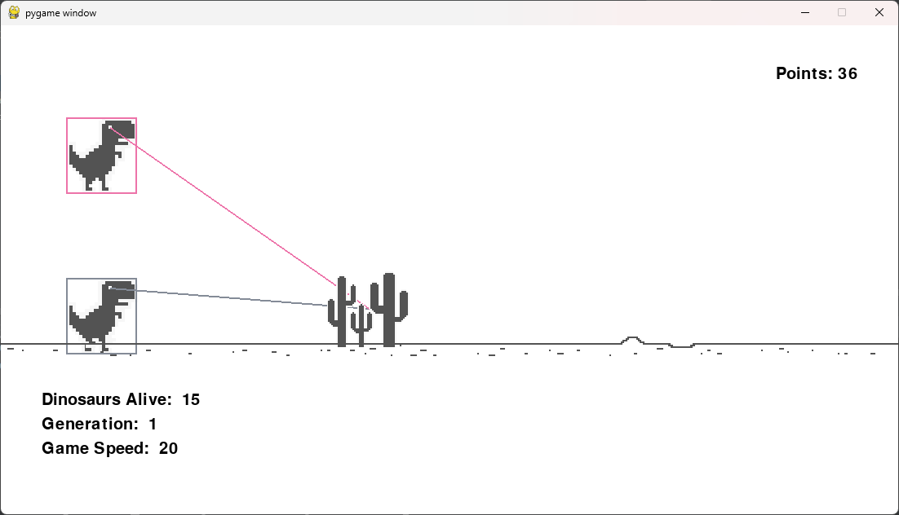

# NEAT-Dino
NEAT-Dino is a Python project that utilizes the NEAT (NeuroEvolution of Augmenting Topologies) algorithm to create an autonomous agent for playing the Google Chrome Dinosaur Game. The agent learns to play the game by evolving neural networks that control the dinosaur's actions, such as running and jumping, to avoid obstacles.

## Overview
This project aims to demonstrate the capabilities of NEAT in creating intelligent behaviors for playing simple video games. The Google Chrome Dinosaur Game serves as a suitable environment for this purpose due to its simplicity and availability.
Additionally, the concepts and techniques employed in this project can be extended to robotics applications. By adapting the NEAT algorithm and neural network architectures, similar autonomous behaviors can be developed for controlling robots in real-world environments.

## Features
- Autonomous gameplay: The dinosaur learns to play the game without human intervention.
- NEAT algorithm: The NeuroEvolution of Augmenting Topologies algorithm is used to evolve neural networks.
- Dynamic obstacles: Various types of obstacles, including small and large cacti, are generated dynamically to challenge the dinosaur.
- Fitness evaluation: The fitness of each neural network is evaluated based on its performance in the game.
- Statistics tracking: The project provides statistics such as the number of dinosaurs alive, the current generation, and the game speed.

## Requirements
- Python3.x
- Pygame
- neat-python

## Installation
1.Clone the repository: 
```
git clone https://github.com/Varun-Ajith/NEAT-Dino.git
```
2. Install Dependencies: `pip install pygame`,
   `pip install neat-python`
## Usage
1. Run the main script: `python main.py`
2. Watch as the dinosaurs evolve and learn to play the game autonomously.



## Robot Applications
The techniques demonstrated in this project have potential applications in robotics, particularly in the development of autonomous robots. By adapting the NEAT algorithm and neural network architectures, similar methods can be used to create intelligent behaviors for controlling robots in real-world scenarios. Examples include autonomous navigation, object detection and manipulation, and collaborative robotics.

## Contributions
Contributions are welcome! If you have any ideas for improvements or new features, feel free to open an issue or submit a pull request.

## Credits

This project was created by Varun Ajith as a demonstration of NEAT-based reinforcement learning.
A heartfelt thank you to all the creators and researchers who contributed to the development of this project.

## License
This project is licensed under the MIT License - see the [LICENSE](LICENSE) file for details.
